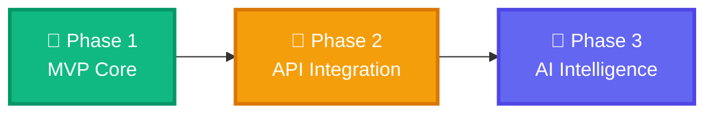

<div align="center">

# 🚀 OptiRider

### Multi-Platform Delivery Management System


<p align="center">
  <strong>🎯 Optimize your delivery earnings across multiple platforms</strong>
</p>


</div>

---

## 📱 What is OptiRider?

OptiRider is a **unified delivery management app** designed for gig-economy riders who work across multiple food and grocery delivery platforms. Track your earnings, analyze performance, and maximize your income—all in one place!

<div align="center">

### 🎨 Features at a Glance

| Feature | Status | Description |
|---------|--------|-------------|
| 📊 **Smart Dashboard** | ✅ Live | Real-time earnings analytics with platform breakdown |
| 📝 **Trip Ledger** | ✅ Live | Manual trip logging with instant sync |
| 💰 **EPH Calculator** | ✅ Live | Earnings Per Hour tracking |
| 🔐 **Secure Auth** | ✅ Live | Firebase email/password authentication |
| 📈 **Platform Analytics** | ✅ Live | Compare performance across Swiggy, Zomato, Uber Eats & Blinkit |
| 💡 **Smart Insights** | ✅ Live | AI-powered recommendations (Phase 1 basics) |

</div>

---

## 🎯 3-Phase Development Roadmap

<div align="center">



</div>

### 🟢 **Phase 1: MVP Foundation** `(Current Release)`

**Manual Data Entry & Analytics Dashboard**

- ✅ Trip logging with platform, earnings & duration
- ✅ Real-time Firebase Firestore sync
- ✅ Dashboard with key metrics (Total Earnings, EPH, Trip Count)
- ✅ Platform-wise breakdown with visual percentages
- ✅ Smart insights & milestone tracking
- ✅ Secure authentication (Email/Password)
- ✅ Beautiful Material Design UI

### 🟡 **Phase 2: Deep Integration** `(Coming Q1 2026)`

**Automated Platform Control via APIs**

- 🔄 Direct API integration with delivery platforms
- 🔄 Auto-sync trip data from Swiggy, Zomato, Uber Eats, Blinkit
- 🔄 One-tap multi-platform status toggle (Go Online/Offline)
- 🔄 Real-time order notifications aggregation
- 🔄 Accessibility-based automation (Android)
- 🔄 Live earnings tracker without manual entry

### 🔵 **Phase 3: AI-Powered Optimization** `(Coming Q2 2026)`

**Machine Learning & Predictive Analytics**

- 🤖 AI-driven route optimization
- 🤖 Peak hour prediction & earnings forecasting
- 🤖 Smart platform recommendations based on historical data
- 🤖 Heatmap analysis for high-demand zones
- 🤖 Automated acceptance/rejection suggestions
- 🤖 Personalized earning strategies

---

## 🚀 Quick Start

### Prerequisites

- Node.js 18+ and npm/yarn
- Expo Go app on your mobile device
- Firebase account (free tier works!)

### Installation

```bash
# Clone the repository
git clone https://github.com/mohdrazakhan/OptiRider-Multi-Platform-Delivery-Management-App.git

# Navigate to project directory
cd OptiRiderApp

# Install dependencies
npm install

# Set up environment variables
cp .env.example .env
# Edit .env with your Firebase credentials

# Start the development server
npx expo start
```

### 📱 Run on Device

1. Install **Expo Go** from [Play Store](https://play.google.com/store/apps/details?id=host.exp.exponent) or [App Store](https://apps.apple.com/app/expo-go/id982107779)
2. Scan the QR code from your terminal
3. Start logging trips and watch your earnings grow! 📈

---

## 🎨 Screenshots

<div align="center">

### 🏠 Dashboard


*Real-time analytics with platform breakdown and EPH tracking*

### 📝 Trip Ledger


*Easy trip logging with recent history*

### 🔐 Authentication


*Secure email/password login*

</div>

---

## 🛠️ Tech Stack

<div align="center">

| Technology | Purpose |
|------------|---------|
| ⚛️ **React Native** | Cross-platform mobile framework |
| 🎨 **Expo SDK 54** | Development toolchain & build system |
| 🔥 **Firebase Firestore** | Real-time NoSQL database |
| 🔐 **Firebase Auth** | User authentication with persistence |
| 🧭 **React Navigation** | Tab & stack navigation |
| 💾 **AsyncStorage** | Local data persistence |
| 📊 **Custom Analytics** | Platform breakdown & EPH calculation |

</div>

---

## 📂 Project Structure

```
OptiRiderApp/
├── 📱 App.js                  # Main app container & navigation
├── 🖼️  screens/
│   ├── WelcomeScreen.tsx     # Onboarding landing page
│   ├── LoginScreen.tsx       # Email/password login
│   └── SignUpScreen.tsx      # Account creation
├── 🎨 components/            # Reusable UI components
├── 🌐 assets/                # Images, fonts, icons
├── 🔧 .env.example           # Environment template
├── 🔐 .env                   # Your Firebase config (gitignored)
└── 📚 README.md              # You are here!
```

---

## 🔐 Security

Your API keys are **safe**! We use environment variables to protect sensitive data:

- ✅ `.env` is gitignored (never committed)
- ✅ `.env.example` provides a template
- ✅ `check-secrets.sh` scans for exposed credentials
- ✅ Firebase security rules protect your data

See [SECURITY.md](./SECURITY.md) for detailed setup instructions.

---

## 🤝 Contributing

We welcome contributions! Here's how you can help:

1. 🍴 Fork the repository
2. 🔨 Create a feature branch (`git checkout -b feature/AmazingFeature`)
3. 💾 Commit your changes (`git commit -m 'Add some AmazingFeature'`)
4. 📤 Push to the branch (`git push origin feature/AmazingFeature`)
5. 🎉 Open a Pull Request

---

## 📜 License

This project is licensed under the MIT License - see the [LICENSE](LICENSE) file for details.

---

## 🌟 Upcoming Features

<div align="center">

| Feature | Phase | ETA |
|---------|-------|-----|
| 🗺️ Route Optimization | 3 | Q2 2026 |
| 📊 Advanced Analytics | 2 | Q1 2026 |
| 🔔 Push Notifications | 2 | Q1 2026 |
| 🌙 Dark Mode | 1.5 | Q4 2025 |
| 📱 Platform Auto-Sync | 2 | Q1 2026 |
| 🤖 AI Recommendations | 3 | Q2 2026 |

</div>

---

## 📞 Support

Having issues? We're here to help!

- 📧 Email: support@optirider.com
- 🐛 [Report a Bug](https://github.com/mohdrazakhan/OptiRider-Multi-Platform-Delivery-Management-App/issues)
- 💡 [Request a Feature](https://github.com/mohdrazakhan/OptiRider-Multi-Platform-Delivery-Management-App/issues/new?labels=enhancement)

---

<div align="center">

### 💖 Built with Love for Delivery Riders

**Made in India 🇮🇳 | B.Tech Major Project 2025**


---

⭐ **Star this repo if you found it helpful!** ⭐


</div>
